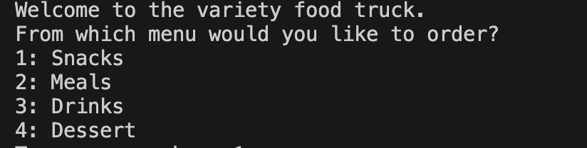
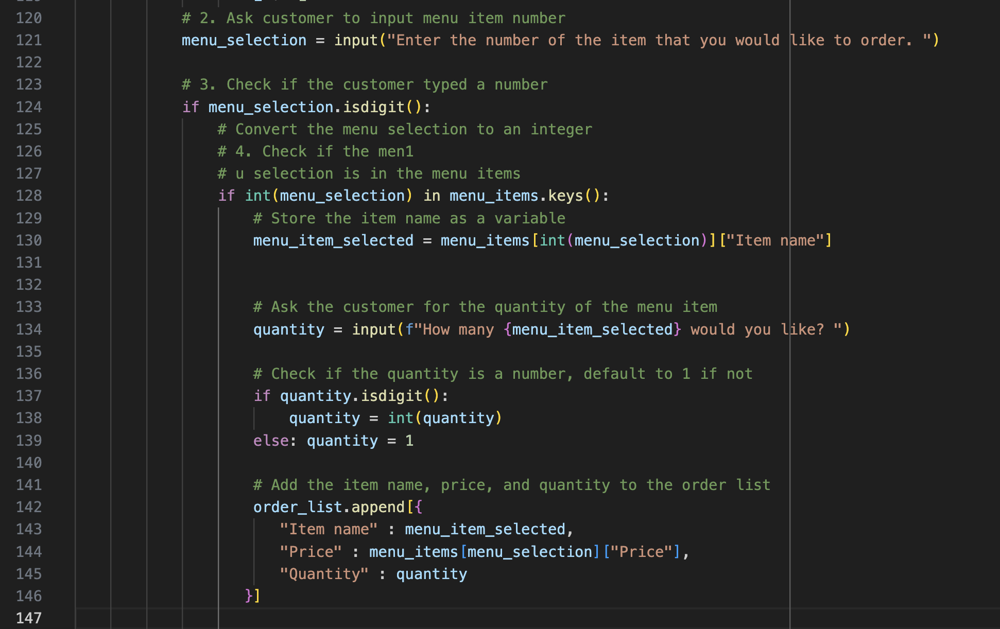

# Python Challenge 1
Welcome to the Variety Food Truck!

## Main Idea
The challenge is to build an interactive menu that allows the customer to choose what, how much, and allows them to finish ordering when they would like to. 

The details like; isdigit(), .lower(), or int() I learned from the the class in the first or the beginning of the week. Other things like match cases and nested loops are new concepts for me. Therefore, all of the code I got are from snippets in the activites. 

## Overall
The code should walk the customer through choosing an item from our main menu which includes snacks, meals, drinks, and desserts. Once the selection is made, they are asked how many they would like to order. Then they are allowed to go back to the main menu and continue to add as many things as they want to their order. If at any point they enter and invalid input, either a message suggesting another input should come out or an error message will appear. At the end, they should recieve a receipt with the full amount of their purchases and total should display.

